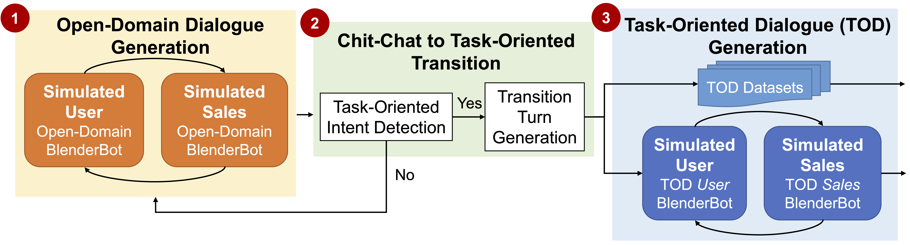

# SalesBot: Transitioning from Chit-Chat to Task-Oriented Dialogues

## Framework
<p align="center">
	
</p>

## Dependency
Check the packages needed or simply run the command
```console
conda env create -f environment.yml
```

## Data
* selfchat:
```console
mkdir selfchat
parlai self_chat --model-file zoo:blender/blender_1Bdistill/model --inference nucleus --num-self-chats 20 --task blended_skill_talk --include-personas True --include-initial-utterances True --outfile selfchat/merge_sgd_20.json
parlai self_chat --model-file zoo:blender/blender_1Bdistill/model --inference nucleus --num-self-chats 20 --task blended_skill_talk --include-personas True --include-initial-utterances True --outfile selfchat/simulators_20.json
```
* intent detection model:
```console
python3 qa_inference.py --data_file selfchat/merge_sgd_20.jsonl --output_file merge_sgd_intent.json --device 0
python3 qa_inference.py --data_file selfchat/simulators_20.jsonl --output_file simulators_intent.json --device 0
```
* task-oriented simulators:
```console
python3 combine_simulators.py simulators_intent.json
```
* merge SGD:
```console
# SGD_delex is the version preprocessed by "ACCENTOR: Adding Chit-Chat to Enhance Task-Oriented Dialogues"
unzip SGD_delex
mkdir sgd_intent_dialog
python3 collect_sgd_intent.py SGD_delex
python3 combine_sgd.py merge_sgd_intent.json

```
* transition:
```console
python3 transition.py combine_sgd.json
python3 transition.py combine_simulators.json
```


